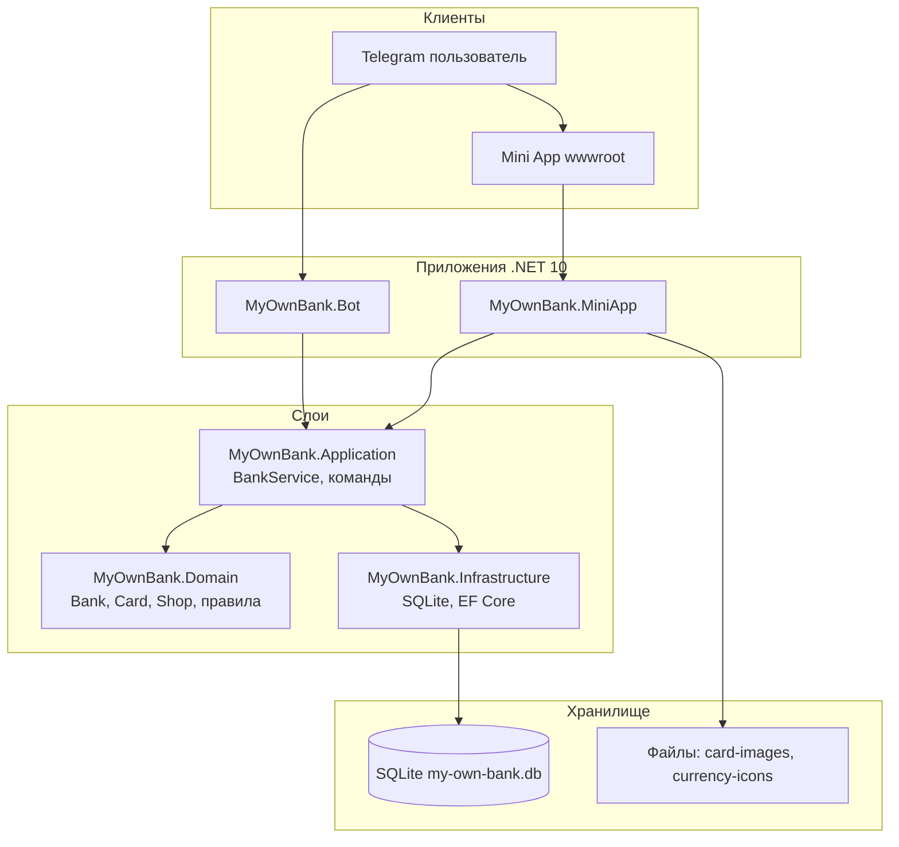
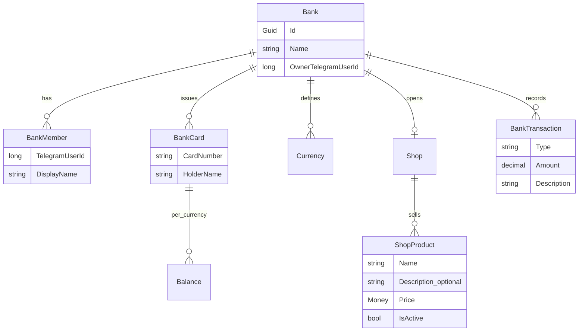
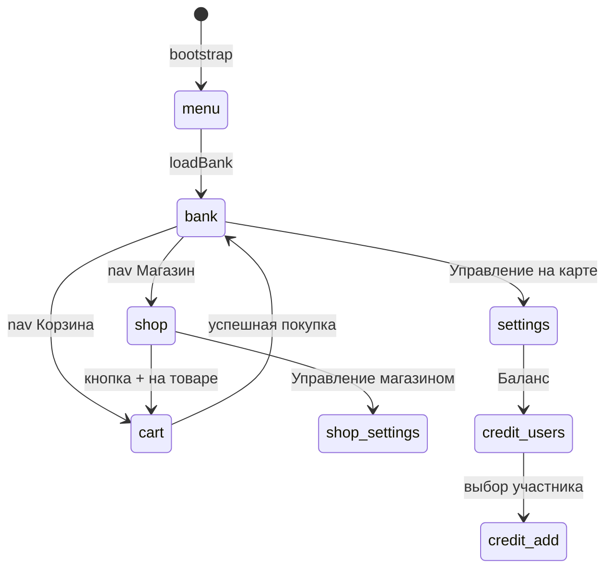
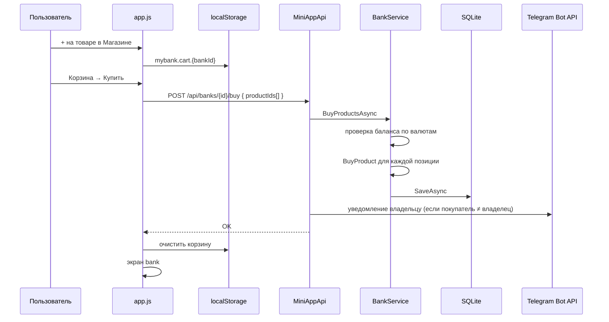

# MyOwnBank — архитектура приложения

Документ для разработчиков и AI-агентов: как устроен проект, какие есть потоки данных и где искать код.

## Обзор системы

Проект — «игровой банк» для пары/компании в Telegram: виртуальные валюты, карты, магазин товаров, покупки.

Два входа в одну SQLite-базу:

| Приложение | Порт (dev) | Назначение |
|------------|------------|------------|
| `MyOwnBank.Bot` | 5218 | Telegram-бот, команды `/balance`, `/buy`, … |
| `MyOwnBank.MiniApp` | 5219 | Web Mini App (основной UI) |

Общая БД в разработке: `data/my-own-bank.db` (корень репозитория).



## Слои (Clean Architecture)

Зависимости направлены внутрь: **Bot / MiniApp → Application → Domain**. Infrastructure реализует контракты Application.

```
MyOwnBank.Domain/          — сущности, инварианты, без БД и HTTP
MyOwnBank.Application/     — сценарии (BankService), DTO, IBankRepository
MyOwnBank.Infrastructure/  — SqliteBankRepository, маппинг, миграции схемы
MyOwnBank.Bot/             — polling Telegram, маршрутизация команд
MyOwnBank.MiniApp/         — статика (app.js), REST API (MiniAppApi.cs)
tests/MyOwnBank.Tests/     — тесты домена
```

Ключевой сервис: `BankService` — единая точка бизнес-логики для бота и Mini App.

## Доменная модель



### Важные правила домена

- У участника банка **одна карта**; балансы — словарь `валюта → сумма`.
- **Владелец** (`OwnerTelegramUserId`) может управлять банком: валюты, начисления, шаблон карты, товары, удаление банка.
- **Покупка**: `Bank.BuyProduct` списывает цену с карты покупателя, пишет транзакцию `purchase`.
- **Товар**: soft-delete через `ShopProduct.Archive()` → `IsActive = false`.
- **Описание товара** — необязательное поле, до 512 символов (`ShopProduct.Description`).

## Mini App — навигация и экраны

Нижнее меню (4 пункта, активны после выбора банка):

| Кнопка | `state.screen` | Содержимое |
|--------|----------------|------------|
| Профиль | `menu` | Список банков, вход по коду, создание банка |
| Банк (дом) | `bank` | Карта, баланс, история операций |
| Магазин | `shop`, `shop-settings` | Каталог товаров; управление — только владельцу |
| Корзина | `cart` | Выбранные товары, оформление покупки |

Дополнительные экраны (без отдельной иконки в nav):

- `settings` — управление банком (валюты, начисление, шаблон, удаление)
- `credit-users` / `credit-add` — начисление валюты участнику
- `app-settings` — тема и имя в приложении
- `create-bank` — создание банка с валютами

Фронтенд: один SPA без фреймворка — `wwwroot/app.js`, состояние в `state`, рендер через `render()`.



## Поток: магазин и корзина



Корзина **только на клиенте** (`localStorage`, ключ `mybank.cart.{bankId}`). Сервер не хранит корзину.

Структура элемента корзины:

```json
{
  "productId": "guid",
  "name": "…",
  "description": "… или null",
  "price": 3,
  "currencyCode": "hug",
  "quantity": 2
}
```

При покупке `productIds` разворачивается по количеству (два одинаковых id = две покупки).

## REST API Mini App

Все запросы POST, тело содержит `initData` (Telegram WebApp) или `"local-dev"` на localhost.

| Endpoint | Кто | Действие |
|----------|-----|----------|
| `POST /api/menu` | все | Список банков пользователя |
| `POST /api/banks/create` | новый владелец | Создать банк + валюты |
| `POST /api/banks/join` | участник | Войти по invite-коду |
| `POST /api/banks/{id}` | участник | Полный снимок банка (карта, товары, история) |
| `POST /api/banks/{id}/products` | владелец | Добавить товар (name, price, currency, description?) |
| `POST /api/banks/{id}/products/delete` | владелец | Архивировать товар |
| `POST /api/banks/{id}/buy` | участник | Купить список товаров |
| `POST /api/banks/{id}/credit` | владелец | Начислить валюту участнику |
| `POST /api/banks/{id}/currencies` | владелец | Добавить валюту |
| `POST /api/banks/{id}/currency` | владелец | Обновить имя/иконку валюты |
| `POST /api/banks/{id}/currencies/{code}/icon` | владелец | Загрузить PNG иконки валюты |
| `POST /api/banks/{id}/card-template` | владелец | Шаблон карты для новых карт |
| `POST /api/banks/{id}/my-card-image` | участник | Своя «шкурка» карты |
| `POST /api/banks/{id}/delete` | владелец | Удалить банк |
| `GET /card-images/...` | все | Отдача картинок карт |
| `GET /currency-icons/...` | все | Отдача иконок валют |

Код API: `src/MyOwnBank.MiniApp/MiniAppApi.cs`.

## Персистентность

- **ORM**: EF Core, `MyOwnBankDbContext`
- **Репозиторий**: `SqliteBankRepository` (in-memory — только для тестов)
- **Схема**: `EnsureCreated` + ручные дополнения в `DatabaseSchemaUpdater` (новые колонки без полноценных миграций EF)
- **Маппинг**: `BankMapper` ↔ `BankEntity` и вложенные сущности

Таблицы: `banks`, `bank_members`, `bank_cards`, `card_balances`, `bank_currencies`, `shops`, `shop_products`, `bank_transactions`, `invitations`.

Поле `shop_products.Description` — `TEXT NULL`, добавляется через `DatabaseSchemaUpdater`.

## Файлы и медиа

| Путь | Назначение |
|------|------------|
| `data/my-own-bank.db` | SQLite |
| `{MountPath}/card-images/{bankId}/` | Шаблон и персональные фото карт |
| `{MountPath}/currency-icons/{bankId}/` | Загруженные иконки валют |

`CardImageStorage` в MiniApp обслуживает HTTP-раздачу.

## Уведомления Telegram

- **Начисление валюты** (бот): `CardCreditedNotification` → сообщение получателю.
- **Покупка в магазине** (Mini App): `ProductPurchasedNotification` → `TelegramNotificationSender` → владельцу банка.

Нужен `TelegramBot:Token` в `appsettings.json` Mini App. Если токен пустой — покупка работает, уведомление пропускается.

## Аутентификация Mini App

`TelegramInitDataValidator` проверяет подпись `initData` от Telegram WebApp.

Локальная разработка (`localhost`): `initData = "local-dev"` → пользователь `1001` / `alice`.

## Где что менять (шпаргалка для агентов)

| Задача | Файлы |
|--------|-------|
| Новое правило банка/карты | `Domain/Banks/`, `Domain/Shops/` |
| Новый сценарий use-case | `Application/Banks/BankService.cs`, `BankCommands.cs` |
| Новый API endpoint | `MiniApp/MiniAppApi.cs` |
| UI / экран | `MiniApp/wwwroot/app.js`, `styles.css` |
| Колонка в БД | `Entities/`, `BankMapper.cs`, `DatabaseSchemaUpdater.cs` |
| Команда бота | `Bot/Telegram/TelegramCommandRouter.cs` |

## Локальный запуск

```powershell
# Mini App (UI + API)
dotnet run --project src/MyOwnBank.MiniApp/MyOwnBank.MiniApp.csproj

# Bot (опционально, для Telegram-команд)
$env:TelegramBot__Token = "YOUR_TOKEN"
dotnet run --project src/MyOwnBank.Bot/MyOwnBank.Bot.csproj
```

После изменений C# в Mini App — перезапуск процесса (DLL блокируется Rider/debugger).

## Тесты

```powershell
dotnet test tests/MyOwnBank.Tests/MyOwnBank.Tests.csproj
```

Доменные тесты: `tests/MyOwnBank.Tests/Domain/BankTests.cs` (баланс, покупки).
